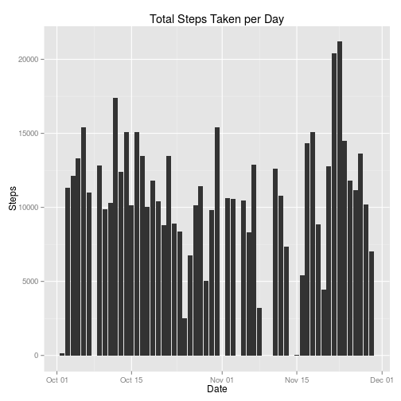
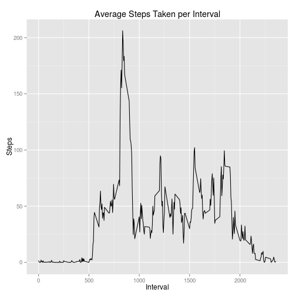
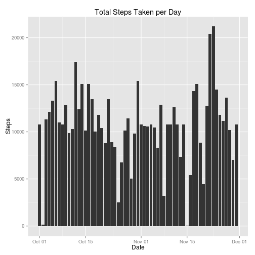
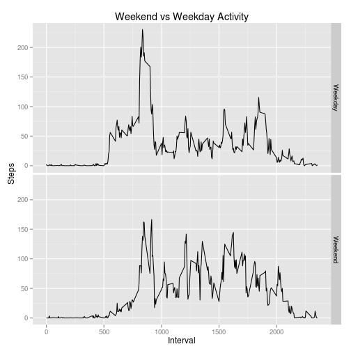

# Reproducible Research: Peer Assessment 1


## Loading and preprocessing the data


```r
unzip("activity.zip")
data <- read.csv("activity.csv", header = T)
data$date <- as.Date(data$date)

library(ggplot2)
```


## What is mean total number of steps taken per day?


Histogram of Total Steps per Day


```r
total_steps <- aggregate(steps ~ date, data = data, FUN = sum)
qplot(
    x = date,
    y = steps,
    data = total_steps,
    geom = "histogram",
    stat = "identity",
    main = "Total Steps Taken per Day",
    xlab = "Date",
    ylab = "Steps")
```

 

Mean Steps per Day


```r
mean(total_steps$steps)
```

```
## [1] 10766
```

Median Steps per Day


```r
median(total_steps$steps)
```

```
## [1] 10765
```


## What is the average daily activity pattern?


```r
interval_steps <- aggregate(steps ~ interval, data = data, FUN = mean)
qplot(
    x = interval,
    y = steps,
    data = interval_steps,
    geom = "line",
    stat = "identity",
    main = "Average Steps Taken per Interval",
    xlab = "Interval",
    ylab = "Steps")
```

 

Interval with Maximum Number of Steps


```r
interval_steps[which(interval_steps$steps == max(interval_steps$steps)),1]
```

```
## [1] 835
```

## Imputing missing values

Total Number Missing Values in Data


```r
length(data[is.na(data)])
```

```
## [1] 2304
```

Impute Data Based on the Average Steps per Interval


```r
imputed_data <- data
for(row in 1:nrow(imputed_data)) {
    if(is.na(imputed_data[row,1])) {
        imputed_data[row,1] <- interval_steps[
            which(interval_steps$interval == imputed_data[row,3]),2]
    }
}
```

Histogram of Imputed Data


```r
total_imputed_steps <- aggregate(steps ~ date, data = imputed_data, FUN = sum)
qplot(
    x = date,
    y = steps,
    data = total_imputed_steps,
    geom = "histogram",
    stat = "identity",
    main = "Total Steps Taken per Day",
    xlab = "Date",
    ylab = "Steps")
```

 

Mean Steps per Day (Imputed Data)


```r
mean(total_imputed_steps$steps)
```

```
## [1] 10766
```

Median Steps per Day (Imputed Data)


```r
median(total_imputed_steps$steps)
```

```
## [1] 10766
```

The mean and median of the imputed data are very similar to the mean and median
of the original data, which makes sense because I replaced the missing values
with the mean of the average steps taken in that interval. Overall, there does
not seem to be a significant impact of imputing the missing values on the mean
and median, however, I do know that the confidence intervals will (unjustifiably)
increase on my estimate of the mean and median if I use this data to estimate
the mean and median of the population.

## Are there differences in activity patterns between weekdays and weekends?

Create Day Type Column


```r
day_type <- c()
for(row in 1:nrow(imputed_data)) {
    if(weekdays(imputed_data[row,2]) == "Saturday" || 
        weekdays(imputed_data[row,2]) == "Sunday") {
        day_type <- c(day_type, "Weekend")
    } else {
        day_type <- c(day_type, "Weekday")
    }
}
day_type <- as.factor(day_type)
imputed_data$day_type <- day_type
```

Graph Comparing Weekday and Weekend Activity


```r
interval_steps_weekend <- aggregate(steps ~ interval,
    data = imputed_data[which(imputed_data$day_type == "Weekend"),],
    FUN = mean)
interval_steps_weekend$day_type <- "Weekend"
interval_steps_weekday <- aggregate(steps ~ interval,
    data = imputed_data[which(imputed_data$day_type == "Weekday"),],
    FUN = mean)
interval_steps_weekday$day_type <- "Weekday"
combined_interval_steps <- rbind(interval_steps_weekday, interval_steps_weekend)
combined_interval_steps$day_type <- as.factor(combined_interval_steps$day_type)
qplot(
    x = interval,
    y = steps,
    data = combined_interval_steps,
    geom = "line",
    main = "Weekend vs Weekday Activity",
    xlab = "Interval",
    ylab = "Steps",
    facets = day_type ~ .)
```

 


